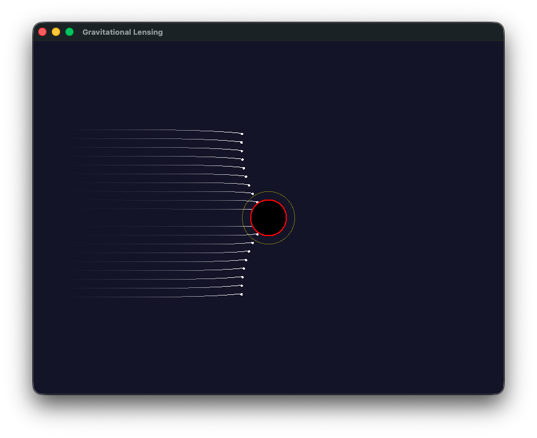

# Gravitational Lensing Simulator

A real-time simulation of gravitational lensing around a Schwarzschild black hole, built with C++ and SFML.



## Overview

Light rays are traced using the null geodesic equation derived from the Schwarzschild metric in general relativity. Each ray is numerically integrated in polar coordinates around the black hole, producing physically accurate bending, capture, and photon sphere orbits.

---

## Physics

### 1. Einstein's Field Equations

Everything starts here. Einstein's field equations describe how mass and energy curve spacetime:

```
G_μν = 8π T_μν
```

The left side is the curvature of spacetime. The right side is the distribution of mass and energy. Solving this for a given mass tells you the geometry of spacetime around it.

---

### 2. The Schwarzschild Metric

Karl Schwarzschild solved Einstein's equations in 1916 for the simplest case: a single non-rotating, spherically symmetric mass in a vacuum. His solution gives the geometry of spacetime around that mass.

From this solution, the **Schwarzschild radius** falls out naturally:

```
r_s = 2GM / c²
```

This is the radius at which spacetime is so curved that not even light can escape — the event horizon. For a mass M, G is the gravitational constant and c is the speed of light.

---

### 3. The Null Geodesic Equation

In GR, objects follow **geodesics** — the straightest possible paths through curved spacetime. For light specifically, we impose the **null condition** `ds² = 0`, which encodes the fact that photons have no proper time.

Applying this to the Schwarzschild metric and working in polar coordinates `(r, φ)` around the black hole gives the geodesic equation for a photon:

```
d²u/dφ² + u = (3GM / c²) · u²
```

where `u = 1/r`. This substitution (called the Binet substitution) replaces `r` with `u = 1/r`, which turns the path integral into a clean second-order ODE that is easy to integrate numerically.

- The left side, `d²u/dφ² + u`, is the flat spacetime term. On its own it describes a straight line.
- The right side, `(3GM/c²) · u²`, is the GR correction. This term does not exist in Newtonian gravity, and is what causes light to bend twice as much as Newton predicts.

---

### 4. Substituting the Schwarzschild Radius

Since `r_s = 2GM/c²`, we can write `3GM/c² = (3/2) · r_s`, giving:

```
d²u/dφ² + u = (3/2) · r_s · u²
```

Rearranged into the form used in the simulation:

```
d²u/dφ² = (3/2) · r_s · u² − u
```

This is the equation integrated in code for every ray, every frame. `r_s` is already computed on the black hole object, so it plugs in directly.

---

### 5. Key Quantities

| Quantity | Formula | Meaning |
|---|---|---|
| Schwarzschild radius | `r_s = 2GM/c²` | Event horizon — rays crossing this are captured |
| Photon sphere | `r = 1.5 · r_s` | Radius at which light orbits the black hole |
| Impact parameter | `b = y` (initial offset) | Perpendicular distance from ray to black hole |

The photon sphere is shown in the simulation as a yellow ring. Rays that pass inside it spiral inward and are captured.

---

### Why Newton Gets It Wrong

Newton's gravity predicts that light bends by **0.87 arcseconds** passing the sun. GR predicts **1.75 arcseconds**. Eddington measured 1.75 in the 1919 solar eclipse — exactly double Newton's prediction.

The reason is that Newton only accounts for the time curvature of spacetime. The GR correction term `(3/2) · r_s · u²` captures the spatial curvature as well, which contributes an equal second half. There is no way to patch Newton's `F = GMm/r²` to get the right answer — the underlying geometry is simply different.

---

## Dependencies

- [SFML](https://www.sfml-dev.org/) 3.x
- CMake 3.16+
- A C++17 compiler

## Build

```bash
mkdir build && cd build
cmake ..
make
./GravLensing
```
